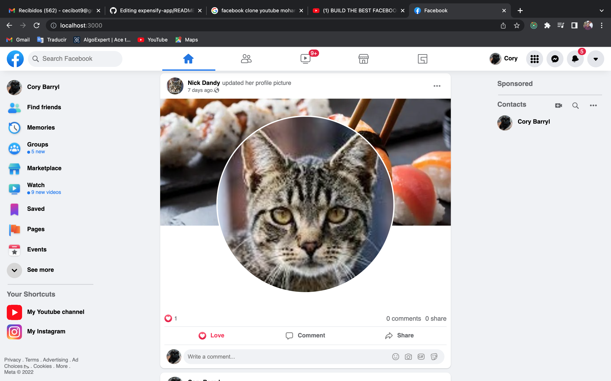

# Facebook (clone) - front-end

This is the front-end part of the web-app made with react and with many facebook features like authentication, password restauration, sending emails, friends system (follow, unfollow, friend request etc), we have a very particular posting system where we have 3 different types of posts, text post, background post and images posts, this can be better apreciated on the views of our pages, we have 3 main pages which are, home, profile and friends, we have a cached history search and a dark theme, we can also react to posts and comment on them, also save or delete a post, we can only see post of our friends and or ourselves, we can upload a profile picture for our user and a cover, much as facebook does, we can unfriend people or reject friendship requests.

## Built With

- JavaScript
- React
- Redux
- Axios
- momment, formik, yup, emoji-picker, js-cookie, react-easy-crop, etc

## Author

### Ceci Benitez

- 👤 [GitHub](https://github.com/Ceci007)

## Video Demo

This demo is the final version with backend and front-end put together
[facebookclone demo](https://www.youtube.com/watch?v=z1UMKqMN3VQ&t=198s)

## Show your support

Give a ⭐️ if you like this project

## Acknowledgments

- Inspiration
  Udemy course with Mohamed Hajji as mentor.
